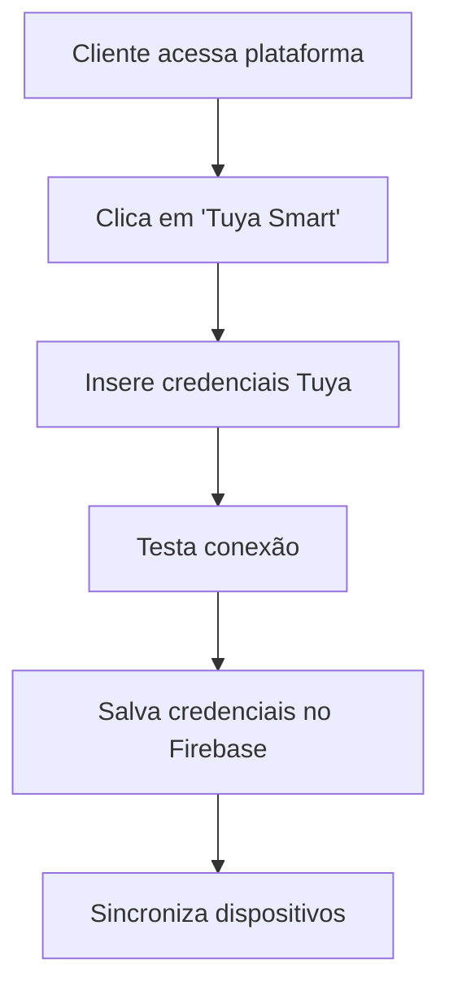
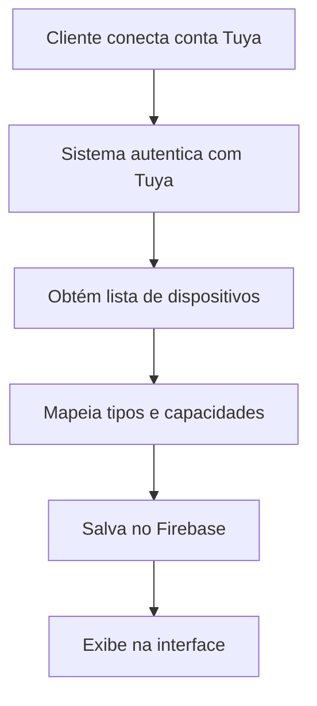
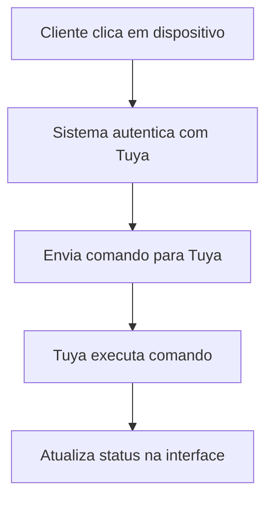

# Integração Tuya Smart - Home Conectado

## 📋 Visão Geral

Este documento descreve a integração completa com a API da Tuya Smart para sincronização automática de dispositivos inteligentes na plataforma Home Conectado.

## 🔧 Configuração

### 1. Credenciais da Tuya

Para usar a integração, você precisa das seguintes credenciais da Tuya:

```javascript
// Configurações necessárias
const tuyaConfig = {
  clientId: 'your_tuya_client_id',
  clientSecret: 'your_tuya_client_secret',
  baseURL: 'https://openapi.tuyaus.com'
}
```

### 2. Variáveis de Ambiente

Crie um arquivo `.env` na raiz do projeto:

```env
# Tuya Smart Configuration (Credenciais da Aplicação)
VITE_TUYA_APP_CLIENT_ID=your_tuya_app_client_id
VITE_TUYA_APP_CLIENT_SECRET=your_tuya_app_client_secret
VITE_TUYA_BASE_URL=https://openapi.tuyaus.com

# Chave de Criptografia (IMPORTANTE: Use uma chave forte em produção)
VITE_ENCRYPTION_KEY=your_strong_encryption_key_here
```

**⚠️ IMPORTANTE:** As credenciais dos clientes são armazenadas criptografadas no Firebase, não nas variáveis de ambiente.

## 🏗️ Arquitetura

### Serviços

- **`tuyaService.js`** - Serviço principal para comunicação com a API Tuya
- **`TuyaContext.jsx`** - Contexto React para gerenciamento de estado
- **`TuyaConnection.jsx`** - Interface para conectar conta Tuya
- **`TuyaDeviceControl.jsx`** - Controle de dispositivos Tuya

### Funcionalidades

#### ✅ Autenticação
- Login com credenciais Tuya
- Renovação automática de tokens
- Gerenciamento de sessão

#### ✅ Sincronização de Dispositivos
- Listagem automática de dispositivos
- Mapeamento de tipos de dispositivos
- Sincronização de capacidades

#### ✅ Controle de Dispositivos
- Liga/Desliga
- Controle de brilho (lâmpadas)
- Controle de cor (lâmpadas RGB)
- Controle de volume (alto-falantes)
- Leitura de sensores

## 📱 Interface do Usuário

### Plataforma do Cliente

1. **Aba "Tuya Smart"** - Nova aba na plataforma
2. **Conexão de Conta** - Interface para conectar conta Tuya
3. **Lista de Dispositivos** - Visualização de todos os dispositivos sincronizados
4. **Controle Individual** - Controle de cada dispositivo

### Painel Administrativo

1. **Sincronização de Clientes** - Sincronizar dispositivos de clientes
2. **Estatísticas Tuya** - Relatórios de uso de dispositivos
3. **Controle Remoto** - Controlar dispositivos de clientes

## 🔄 Fluxo de Funcionamento

### 1. Conexão Inicial



### 2. Sincronização de Dispositivos



### 3. Controle de Dispositivos



## 🛠️ Tipos de Dispositivos Suportados

### Lâmpadas Inteligentes
- **Controles**: Liga/Desliga, Brilho, Cor
- **Comandos**: `switch_led`, `bright_value`, `colour_data`

### Alto-falantes
- **Controles**: Liga/Desliga, Volume
- **Comandos**: `switch`, `volume`

### Sensores
- **Leituras**: Temperatura, Umidade, Movimento
- **Comandos**: `temp_value`, `humidity_value`, `motion_sense`

### Câmeras
- **Controles**: Liga/Desliga, Gravação
- **Comandos**: `switch`, `recording`

## 🔐 Segurança

### Credenciais do Cliente
- **Armazenamento**: Criptografadas com AES-256 no Firebase
- **Acesso**: Apenas o cliente pode acessar seus dispositivos
- **Isolamento**: Cada cliente tem acesso apenas aos seus dispositivos
- **Criptografia**: Credenciais são criptografadas antes de salvar no banco
- **Descriptografia**: Apenas quando necessário para autenticação

### Tokens de Acesso
- **Renovação**: Automática quando expira
- **Segurança**: Não armazenados permanentemente
- **Rotação**: Renovados a cada sincronização
- **Temporários**: Tokens são descartados após uso

### Criptografia de Dados
- **Algoritmo**: AES-256 para criptografia de credenciais
- **Chave**: Chave secreta configurada em variáveis de ambiente
- **Integridade**: Verificação de integridade dos dados
- **Timestamp**: Controle de idade das credenciais

## 📊 Monitoramento

### Estatísticas Disponíveis
- Total de dispositivos por cliente
- Dispositivos online/offline
- Distribuição por tipo
- Última sincronização

### Logs de Atividade
- Tentativas de conexão
- Comandos enviados
- Erros de sincronização
- Status de dispositivos

## 🚀 Próximos Passos

### Funcionalidades Planejadas
- [ ] Rotinas baseadas em dispositivos Tuya
- [ ] Cenas automáticas
- [ ] Integração com Alexa/Google
- [ ] Relatórios de uso
- [ ] Alertas de status

### Melhorias Técnicas
- [ ] Cache de dispositivos
- [ ] Sincronização em tempo real
- [ ] Webhooks da Tuya
- [ ] Otimização de performance

## 🐛 Solução de Problemas

### Erros Comuns

#### "Falha na autenticação com a Tuya"
- Verificar credenciais do cliente
- Confirmar se a conta Tuya está ativa
- Verificar conectividade com a API

#### "Dispositivos não sincronizados"
- Verificar se o cliente tem dispositivos na conta Tuya
- Confirmar permissões da API
- Verificar logs de erro

#### "Comando não executado"
- Verificar se o dispositivo está online
- Confirmar se o comando é suportado
- Verificar status da conexão Tuya

## 📞 Suporte

Para dúvidas sobre a integração Tuya:

- **Documentação Tuya**: https://developer.tuya.com/
- **API Reference**: https://developer.tuya.com/en/docs/cloud/
- **Suporte Home Conectado**: contato@homeconectado.com.br

---

**Desenvolvido por Home Conectado**  
*Transformando casas em lares inteligentes*
